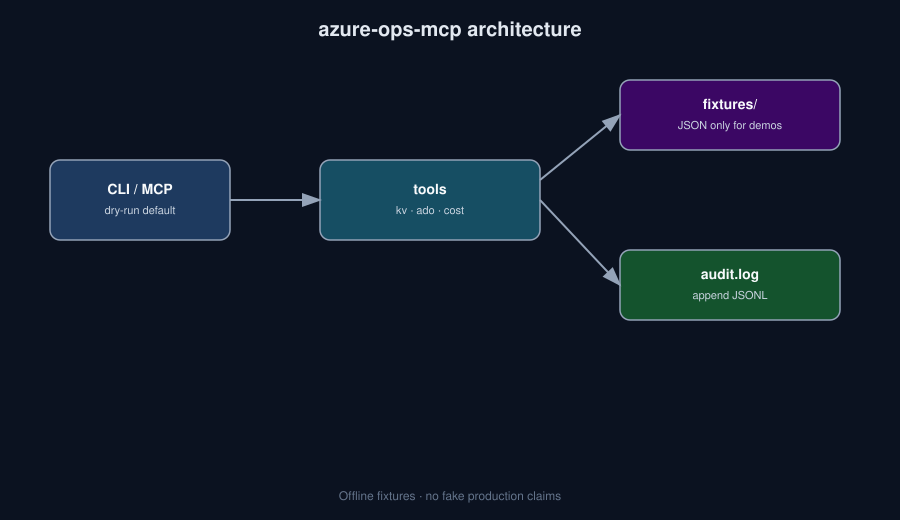

# azure-ops-mcp


**Azure ops tools for agents: Key Vault compare, ADO diagnose, cost stub — dry-run default + append-only audit log.**

> Who it's for: Azure platform SAs building agent tools that must stay auditable.

## Why this exists

Ops copilots without guardrails are scary. This package exposes MCP-shaped tools that prefer **fixtures + dry-run**, and every invocation appends an audit line. Live Azure wiring is opt-in later; demos never need cloud credentials.

## Install

```bash
python -m venv .venv && source .venv/bin/activate
pip install -e .
# optional MCP SDK transport:
pip install -e ".[mcp]"
```

Or with pipx (once published to PyPI): `pipx install azure-ops-mcp` — until then use editable install from this repo.

## 30-second demo

```bash
python -m azure_ops_mcp --help
python -m azure_ops_mcp kv-compare fixtures/vaults/dev-vault.json fixtures/vaults/prod-vault.json
python -m azure_ops_mcp ado-diagnose fixtures/ado/failed-job.json
python -m azure_ops_mcp cost-stub fixtures/cost/sample-costs.json
```

Or simply:

```bash
make demo
```

## What it is NOT

- Not a replacement for Azure Portal / Cost Management
- Not granted production RBAC in this repo
- Not a write-path auto-remediator

## Architecture



## Roadmap

- [ ] Read-only Azure SDK adapters behind env flags
- [ ] Richer cost dimensions + budget alerts (stub → live)
- [ ] MCP resource endpoints for vault inventory

## Contributing

See [CONTRIBUTING.md](./CONTRIBUTING.md). Be kind — [CODE_OF_CONDUCT.md](./CODE_OF_CONDUCT.md). Security reports: [SECURITY.md](./SECURITY.md).

## MCP / Cursor plug-in

Install the optional MCP extra, then point Cursor (or any MCP host) at the stdio server:

```bash
pip install -e ".[mcp]"
```

Example `~/.cursor/mcp.json` entry:

```json
{
  "mcpServers": {
    "azure-ops-mcp": {
      "command": "python",
      "args": ["-m", "azure_ops_mcp.mcp_server"],
      "cwd": "/absolute/path/to/azure-ops-mcp"
    }
  }
}
```

Without the SDK, list tool schemas via CLI (`tools` subcommand where available) or see `src/azure_ops_mcp/` for the JSON-RPC-shaped tool table.

## License

MIT
